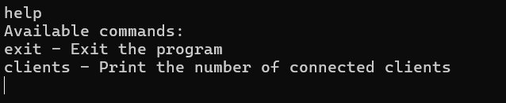
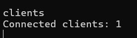
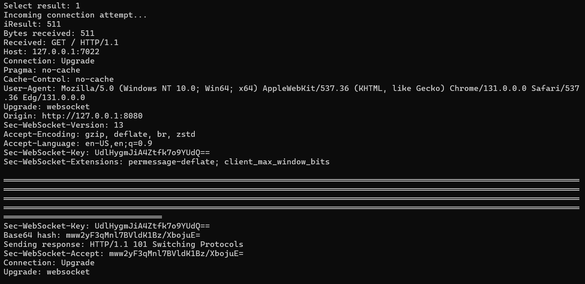
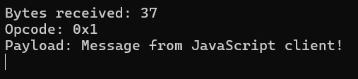

# WebsocketTest

A simple websocket server build in C++.

### Build and run:
The included `CMakeLists.txt` requires CMAKE v3.1 or newer.

Build as normal:  
```
cmake .  
cmake --build .  
```
Then run the compiled executable. Server will run in a command window, automatically listening for connections and accepting text input.

### Supported commands:
`help` Lists available commands.  

  

`exit` Stops the server and quits the program. (No output.)  

`clients` Shows the number of connected clients.  



### Connecting a client:
The server should support handshake with any client connections following the WebSocket protocol as defined in `rfc6455`. When a client connects, the server console will display the received headers.

  

### Text messages:
Anything typed into the server console that is not a recognized command will be sent as a text message to all connected clients.  

The server does not currently support any client commands so if any messages are received from a client, the size of the message in  bytes, the opcode, and the unmasked payload will be printed to the server console.

  
